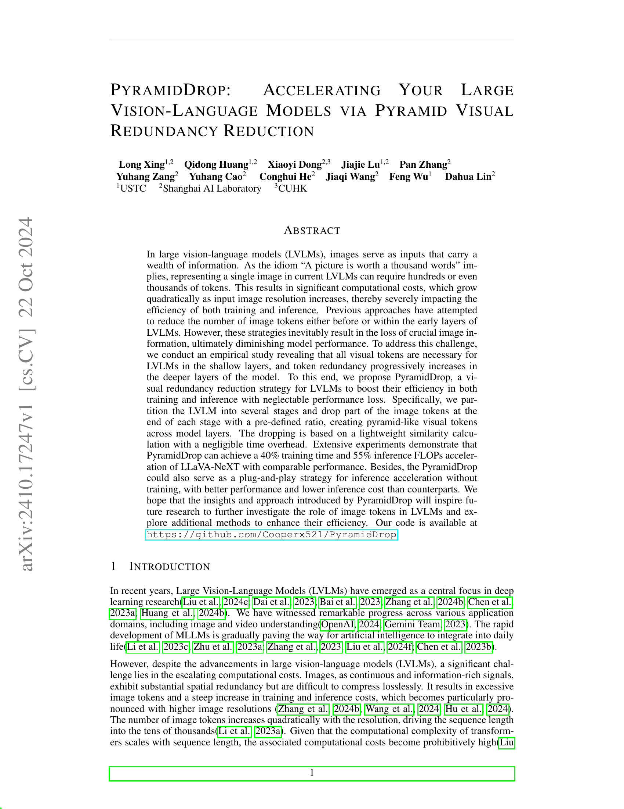
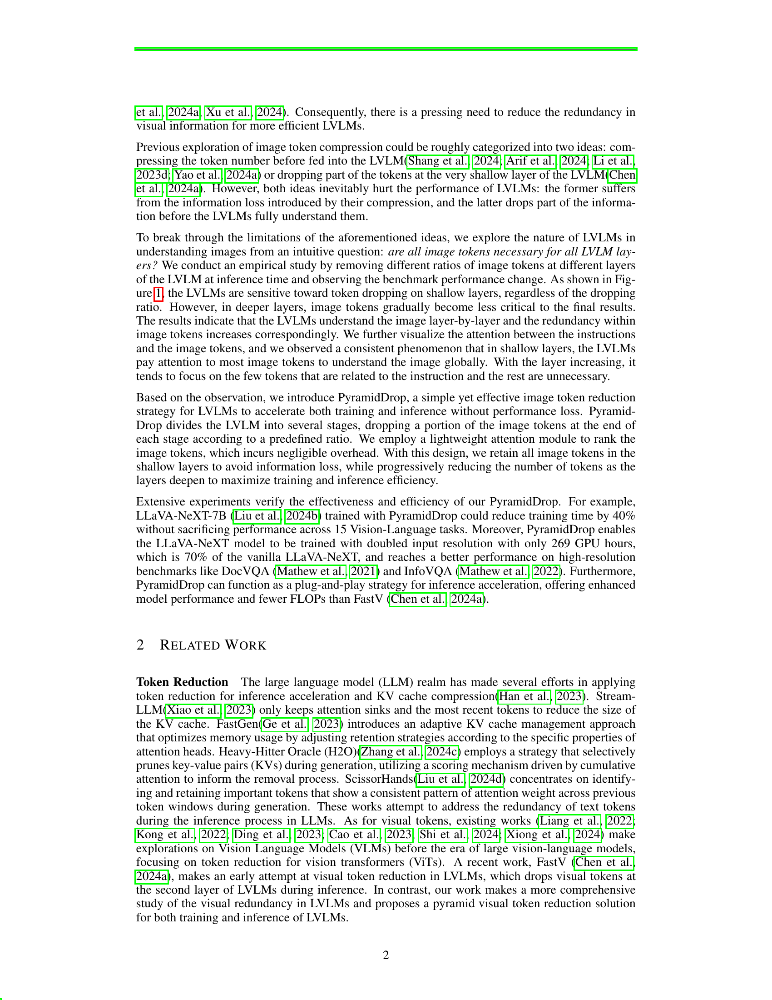
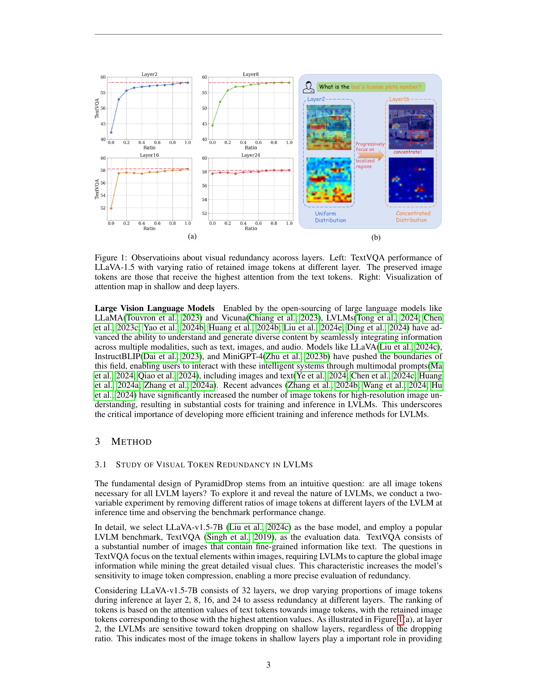
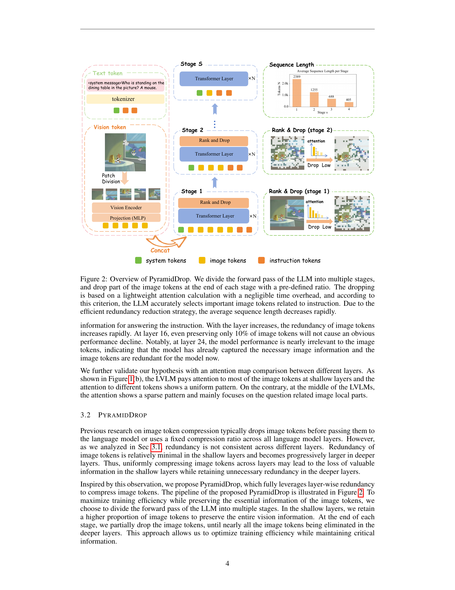
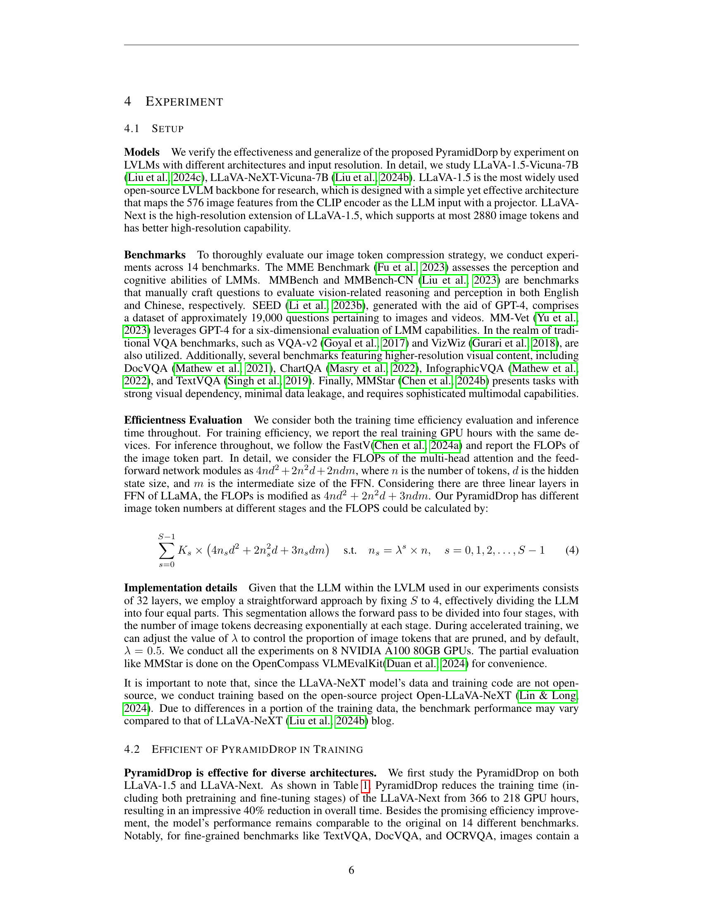
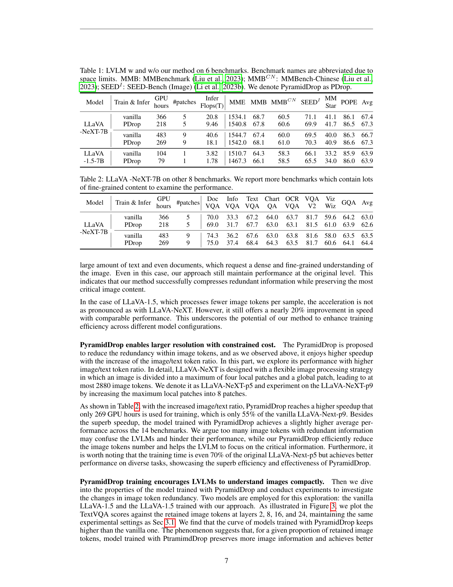
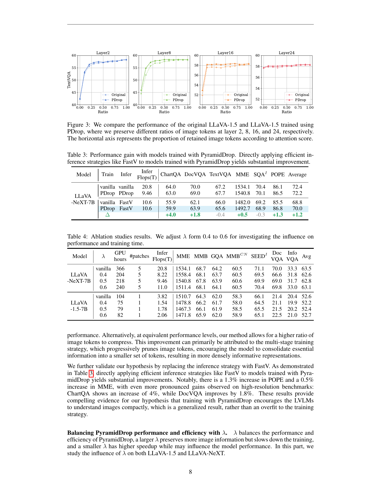
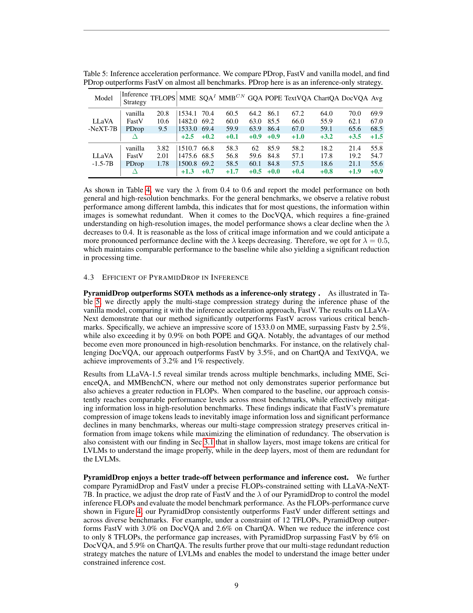
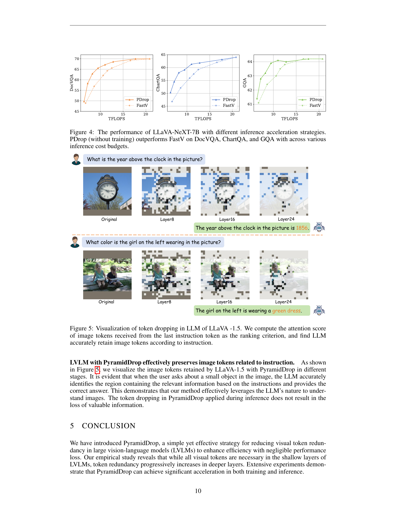

## TLDR;


Large vision-language models (LVLMs) are computationally expensive because images require many tokens. Existing methods for reducing these tokens either lose crucial information or only drop tokens early, impacting performance. PyramidDrop offers a novel solution: it strategically drops a portion of image tokens at the end of each stage of the LVLM, starting with a smaller portion in early stages and progressively increasing in later stages. This leverages the observation that visual token redundancy increases as the model processes deeper layers.

This simple yet effective approach significantly accelerates both training and inference. Experiments demonstrate up to a 40% reduction in training time and a 55% reduction in inference FLOPs for LLaVA-NeXT, achieving comparable or even better performance than original models. PyramidDrop can also be used as a plug-and-play inference acceleration technique, outperforming other methods. The results suggest that not all visual tokens are equally important in all layers of the model, providing valuable insights for future LVLMs.



 [**Read the full paper at arXiv**](https://huggingface.co/papers/2410.17247)

### How to read guide

Let's learn how to read this paper efficiently


**Introduction & Related Work([1](#1-introduction) & 2)**  
Start by grasping the overall problem: LVLMs are slow due to the high number of image tokens. Understand the context of existing token reduction methods and why they are insufficient. This sets the stage for the proposed solution.


 


**Study of Visual Token Redundancy(3.1)**  
This is crucial. The paper's core insight is revealed here – that image token redundancy increases across layers of the LVLM. Understanding the empirical evidence (Figure 1) is essential to appreciating the rationale behind PyramidDrop.
  

 


**PyramidDrop Method(3.2)**  
After understanding the problem and the key insight, dive into the proposed solution. Focus on how PyramidDrop works: the staged approach, token dropping based on attention weights, and the overall design (Figure 2).


 


**Efficiency Analysis(3.3)**  
This section justifies the claimed efficiency gains. While potentially more technical, understanding the computational complexity argument adds weight to the method's practicality. Don't get bogged down in complex equations; focus on the general conclusions.


 


**Experiments & Results(4)**  
This section presents the results. It's crucial to understand the trade-offs and the performance of PyramidDrop compared to the baseline. Focus on the key results (Tables 1, 2, 5, Figures 3, 4).


 


**Ablation Study & Further Analysis(4.2 & 4.3)**  
This strengthens the claims. Analyze how different choices in hyperparameters (e.g., the dropping ratio) affect the results. This section provides further justification and context. Visualizations in Figure 5 can provide additional intuition.


 


**Conclusion(5)**  
Recap the main findings and the significance of the work.


## 1. INTRODUCTION

Large Vision-Language Models (LVLMs) have shown remarkable progress in various applications, but their computational costs are a significant challenge.  Images, as information-rich inputs, are often represented using hundreds or even thousands of tokens in current LVLMs. This leads to quadratically increasing computational costs with higher image resolutions, impacting both training and inference efficiency. Previous methods tried reducing image tokens either before or within early LVLM layers, but this resulted in information loss and diminished performance. The introduction highlights the need for new approaches to address the efficiency challenges posed by the high dimensionality of image data in LVLMs, setting the stage for the proposed PyramidDrop method.

### **Key Points**
- The computational cost of LVLMs grows quadratically with image resolution.
- Current methods for reducing image tokens often lead to information loss and reduced performance.
- Images, despite being rich in information, exhibit substantial spatial redundancy.
- The need for efficient training and inference of LVLMs is highlighted as a critical problem in the field of deep learning research.
- The introduction sets the stage for the proposed PyramidDrop method which aims to address the aforementioned challenges of efficiency and information loss associated with large vision-language models.


  
  


## 2. RELATED WORK

The related work section focuses on existing research in token reduction, specifically within large language models (LLMs) and, to a lesser extent, vision-language models (VLMs).  Regarding LLMs, several methods aim to reduce the number of tokens processed for faster inference and reduced memory usage. These include techniques that optimize the Key-Value cache, selectively prune less important tokens, or retain only attention sinks. However, these methods primarily address text tokens. For VLMs, existing work before the rise of large vision-language models (LVLMs) explored token reduction strategies for vision transformers (ViTs).  A recent approach, FastV, attempts visual token reduction in LVLMs by dropping tokens in the shallow layers.  The current study contrasts with these prior efforts by presenting a comprehensive investigation into visual token redundancy across layers in LVLMs and proposing a novel, pyramid-based token reduction strategy that is more nuanced and adaptive.

### **Key Points**
- Focuses on token reduction in LLMs and VLMs, highlighting the scarcity of work on visual token reduction in LVLMs before this work.
- Discusses methods like Stream-LLM, FastGen, H2O, and ScissorHands for LLM token reduction, emphasizing the absence of methods that effectively handle visual token redundancy across multiple layers.
- Contrasts existing work on ViT token reduction with the current research on LVLM token reduction, preparing the reader for the novelty of the pyramid-based token reduction approach.
- Mentions FastV as a precursor, but highlights its limitation of only considering token dropping at shallow layers, which lacks the sophistication of the new pyramid-based approach.
- Provides a clear overview of how the proposed work addresses the shortcomings of existing token reduction methods by focusing on a more adaptive and layer-wise strategy, setting the stage for more comprehensive explanation in subsequent sections. 


  
  


## 3. METHOD

This section details PyramidDrop, a method designed to improve the efficiency of large vision-language models (LVLMs) by reducing redundancy in visual tokens.  The core idea stems from the observation that visual token importance decreases as the model processes deeper layers.  PyramidDrop addresses this by dividing the LVLM's forward pass into multiple stages (the paper uses 4 stages as an example). At the end of each stage, a portion of the least important image tokens are dropped based on a pre-defined ratio (λ, often set to 0.5). The least important tokens are identified using a lightweight attention mechanism that compares the attention weights between image tokens and the last instruction token, incurring minimal computational overhead.  This process creates a 'pyramid' effect, with all tokens preserved in the initial layers but progressively fewer in deeper layers, aiming to maintain critical information while removing redundancy.  The method is designed to work for both training and inference, with claimed acceleration of 40% training time and 55% inference FLOPs on LLaVA-NeXT-7B.

The selection of less important tokens is crucial.  The paper employs a lightweight attention mechanism focusing on attention between image tokens and the last instruction token within each stage to rank image token importance.  The rationale is that crucial visual information is processed in earlier layers, while deeper layers contain increasing amounts of redundancy. The similarity calculation used for ranking is computationally inexpensive, making it a practical approach. The choice of 4 stages is an example, and the ratio λ (a hyperparameter controlling the rate of token reduction) can be adjusted. The goal is to optimize training efficiency without sacrificing performance.

The effectiveness of PyramidDrop is evaluated through experiments on LLaVA-1.5 and LLaVA-NeXT models, using various benchmarks (TextVQA, DocVQA, MMBench, etc.).  The paper highlights a significant reduction in training time and inference FLOPs with minimal to no performance loss in many cases. It also presents an analysis of the computational cost of the method, showing significant savings compared to naive methods. The proposed attention mechanism for selecting tokens is designed to be lightweight, and the analysis suggests minimal overhead when incorporated into the existing architecture.

Overall, PyramidDrop offers a strategy for efficiently reducing the computational cost of processing image tokens in LVLMs. By recognizing and exploiting the inherent redundancy in visual representations at later stages of the model, this method appears to provide a cost-effective way to achieve performance gains both during training and at inference time.

 shows four line graphs illustrating the TextVQA performance of LLaVA-1.5 at various layers (Layer2, Layer8, Layer16, and Layer24) as a function of the ratio of retained image tokens.  The x-axis represents the retained ratio, and the y-axis shows the TextVQA score. Each graph reveals how the model's performance changes as the number of input image tokens is reduced at different stages of the LLM.  (b) presents a visualization of visual token redundancy and attention mechanisms across model layers, exemplified with the TextVQA question \"What is the bus's license plate number?\".  The top portion displays the original image and attention maps (visualizations) at Layer2 and Layer16, where the attention shifts from a uniform distribution across all tokens at Layer2 to a highly concentrated distribution on a localized region of the image at Layer16. The bottom portion emphasizes this visual shift, showing a comparison between the initial uniform and later concentrated attention patterns, highlighting the increasing redundancy and importance of selection as the LLM processes information through its layers.")

### **Key Points**
- The core idea is that visual token importance decreases as the model goes deeper.
- PyramidDrop divides the LVLM's forward pass into multiple stages (e.g., 4 stages).
- At the end of each stage, a pre-defined ratio (λ, often 0.5) of the least important image tokens are dropped.
- Least important tokens are identified using a lightweight attention mechanism.
- This leads to a 40% reduction in training time and 55% reduction in inference FLOPs on LLaVA-NeXT-7B (claimed).


  
  


## 4. EXPERIMENT

This experiment section focuses on evaluating the PyramidDrop method's efficiency and effectiveness in both training and inference phases.  Two large vision-language models (LVLMs), LLaVA-1.5-Vicuna-7B and LLaVA-Next-Vicuna-7B, are used as the base models.  The high-resolution capability of LLaVA-Next allows experiments exploring the effects of varied image tokens. A total of 14 benchmarks, including TextVQA, DocVQA, MMBench, and MME, are employed to comprehensively assess the model's performance.  Efficiency evaluation includes training time (GPU hours) and inference FLOPs, aiming to quantify the computational savings brought by PyramidDrop. Implementation details specify that the LLM's 32 layers are split into 4 stages with a drop ratio of 0.5, where 50% of the image tokens are dropped at the end of each stage. The ranking of tokens is based on the attention value between image tokens and the last token of the instruction, ensuring the model maintains essential information while discarding redundancies. Results demonstrate that PyramidDrop can reduce training time up to 40% for LLaVA-Next and shows promise as a plug-and-play inference acceleration strategy.

. Each subplot represents a different layer, illustrating how the TextVQA score changes as a higher proportion of image tokens are preserved.  The x-axis in each subplot represents the ratio of retained image tokens (from 0 to 1), while the y-axis represents the corresponding TextVQA score.  In all layers, the model trained with PyramidDrop shows consistently higher or comparable performance to the original model, suggesting that the PyramidDrop method effectively reduces redundancy without sacrificing performance.")

### **Key Points**
- 40% reduction in training time for LLaVA-Next with PyramidDrop
- 14 benchmarks used for comprehensive evaluation
- LLaVA-1.5 and LLaVA-Next models used
- Efficiency measured in GPU hours and FLOPs
- Implementation details clearly describe the layer splitting and token dropping strategy


  
  
  
  
  
